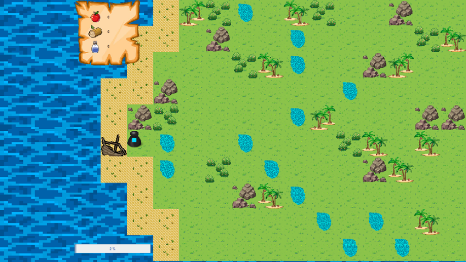

# Wotah
  Ce jeu est le projet de fin de semestre pour le cours de PCII en L3 informatique.
Notre insiparation s'est tournée vers le jeu Starcraft pour sa construction de batiment et son controle d'unités et le jeu de société Galèrapagos pour le coté survie gestion de ressource.

Il en ressort alors un jeu ou l'on controle des personnages seul ou a plusieurs en drag and drop et ou l'objectif est de récolté assez d'eau de bois et de nourriture pour s'enfuir de l'ile on nous avons fait naufrage avant qu'une tempete n'arrive et ne se déchaine.

`2023` - `Java`, `Swing`, `Jeu`, `Langage Objet`, `MVC`, `IntelliJ`

## Installation
Pour lancer le projet :

•	Prérequis : Java avec un IDE compatible.

•	Mode d’emploi : Importez le projet dans l’IDE, et sélectionner la méthode main de la classe Main, cliquez ensuite sur le bouton « Run ». Le projet est ensuite ouvert, il suffit ensuite de déplacer un joueur en drag and drop à la souris pour voir le menu d’action apparaitre et de cliquer sur celle voulu pour qu’il l’exécute.

## Documents
Le compte rendu du projet est disponible ici : [Compte rendu](https://github.com/Julien-LG/Wotah/blob/main/Compte_Rendu_Wotah_Final.pdf) 

Le diagramme de gant est quant à lui ici : [Diagramme](https://github.com/Julien-LG/Wotah/blob/main/Wotah_Diagramme_2.pdf)

## Résultat

